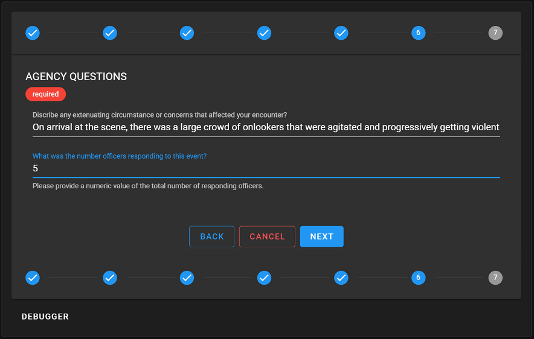

# Cal-RIPA Agency Questions

## Agency specific questions

The RIPA by CSSA application provides a feature that allows each agency the ability to configure additonal questions that are displayed as Step #6 when they are configured. These extra questions are never transmitted to the California DoJ, but can be used internally to track certain metrics your agency desires to trend. Otherwise, if no questions are configured, Step #6 is the final step to review and save the STOP record.

Currently the application only supports text type questions using a standard "TextBox" control. Feel free to clone the repo and add functionality! (It is an Open-Source project just waiting to be extended!)

## Configuring the agency questions

1. Follow the [application configuration](./APP-CONFIG.md) instruction to edit the config.json file.
2. Add any additional questions you want presented to the end user for answering.
3. Save the document and allow 1-2 hours for the Content Delivery Network (CDN) where the content is hosted in Azure to synchronize the changes made to the config.json file.
4. Run the application to verify your questions and test them out!

## Agency question section requirements & description

Within your config.json file you can add as many additional question as you like. It is suggested to keep this section to 1-5 additional questions. There is no limit to the number of questions, but as a side affect, too many will elongate the form and could create a display or user experience (UX) issues for the end users.

    "AgencyQuestions": [ // An array of extra questions to be presented in the STOP form
        {
            "Name": "{A simple name for identifying this question. No spaces in the name is suggested but not required}",
            "Type": "{Currently only supports 'Text'}",
            "Prompt": "{The prompting question you wish the user to answer}",
            "Hint": "{A tool tip displayed when hovered}",
            "MaxLength": 250,
            "Required": {true or false}
        }
    ]

## Sample question

    {
        "Name": "ExtenuatingCircumstance",
        "Type": "Text",
        "Prompt": "Discribe any extenuating circumstance or concerns that affected your encounter?",
        "Hint": "Discribe in detail anything that might have affected the encounter.",
        "MaxLength": 250,
        "Required": true
    }

## Sample screenshot

|  |
|-
