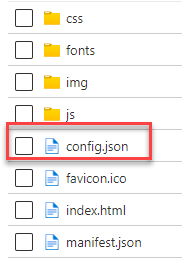

# Cal-RIPA Application Configuration File

## How to locate and edit the config.json file

1. Open the US Government portal [https://portal.azure.us](https://portal.azure.us)
2. Navigate to the Resource Group where you installed RIPA
3. Search for the storage account that ends with the characters “uisa”

|  |
|-

4. Select that storage account
5. Select “Containers” from the left-hand Blades

|  |
|-

6. Select the “$web” container

|  |
|-

7. Select the “config.json” file

|  |
|-

8. Select the “Edit” button

|  |
|-

9. Modify the file as desired and click “Save” at the top of the screen

## Application Configuration File Layout

### The config.json file found in the root folder of the UI content container must meet these criteria & layout

    {
        "Authentication": {
            "ClientId": "{Application (Client) ID in GUID format}",
            "AuthorityUrl": "https://login.microsoftonline.com/{Azure Tenant ID in GUID format}",
            "TenantId": "{Azure Tenant ID in GUID format}",
            "PrimaryDomain": "{Your agencies Fully Qualified Domain Name, example myagency.gov}"
        },
        "Configuration": {
            "Environment": "{DEV, QA or PROD}",
            "ServicesBaseUrl": "{Base URI to your APIM instance}",
            "Subscription": "{Your APIM subscription key}",
            "DefaultCounty": "{The county in which your agency has jurisdiction}",
            "DisplayBeatsInput": "{true or false}",
            "DisplayDebugger": "{true or false}",
            "StopDateLimitDays": "{Number of additional days beyond 24 hours for stop date limit, or null for no limit}"
        },
        "AgencyQuestions": [ // An array of extra questions to be presented in the STOP form
            {
                "Name": "{A simple name for identifying this question. No spaces in the name is suggested but not required}",
                "Type": "{Currently only supports 'Text'}",
                "Prompt": "{The prompting question you wish the user to answer}",
                "Hint": "{A tool tip displayed when hovered}",
                "MaxLength": 250,
                "Required": {true or false}
            }
        ]
    }

### Example config.json file with sample settings

    {
        "Authentication": {
            "ClientId": "12345678-1234-1234-1234-123456789012",
            "AuthorityUrl": "https://login.microsoftonline.com/12345678-1234-1234-1234-123456789012",
            "TenantId": "12345678-1234-1234-1234-123456789012",
            "PrimaryDomain": "mysheriff.gov"
        },
        "Configuration": {
            "Environment": "DEV",
            "ServicesBaseUrl": "https://somesample-apim.azure-api.us/",
            "Subscription": "12345678901234567890123456789012",
            "DefaultCounty": "My County",
            "DisplayBeatsInput": "true",
            "DisplayDebugger": "true",
            "StopDateLimitDays": null
        },
        "AgencyQuestions": [
            {
                "Name": "ExtenuatingCircumstance",
                "Type": "Text",
                "Prompt": "Describe any extenuating circumstance or concerns that affected your encounter?",
                "Hint": "Describe in detail anything that might have affected the encounter.",
                "MaxLength": 250,
                "Required": true
            },
            {
                "Name": "NumberOfOfficers",
                "Type": "Text",
                "Prompt": "What was the number of officers responding to this event?",
                "Hint": "Please provide a numeric value of the total number of responding officers.",
                "MaxLength": 250,
                "Required": true
            }
        ]
    }

## Configuration Settings

### StopDateLimitDays

The `StopDateLimitDays` setting controls how far back in time users can submit stop reports beyond the initial 24-hour warning period.

**Usage:**
- Set to `null` (default): No additional limit beyond the 24-hour warning. Users can submit stops from any date in the past.
- Set to a number: Adds additional days to the 24-hour warning period before preventing submission.

**Examples:**
- `"StopDateLimitDays": null` - No limit (current behavior)
- `"StopDateLimitDays": 2` - Total limit of 3 days (24 hours + 2 days)
- `"StopDateLimitDays": 6` - Total limit of 1 week (24 hours + 6 days)
- `"StopDateLimitDays": 29` - Total limit of 30 days (24 hours + 29 days)

**Behavior:**
- The 24-hour warning alert always appears for stops older than 24 hours
- If a limit is configured and exceeded, users will receive a validation error preventing form submission
- Admin users can override these limits when editing stops
- The alert message includes RIPA regulation compliance text
