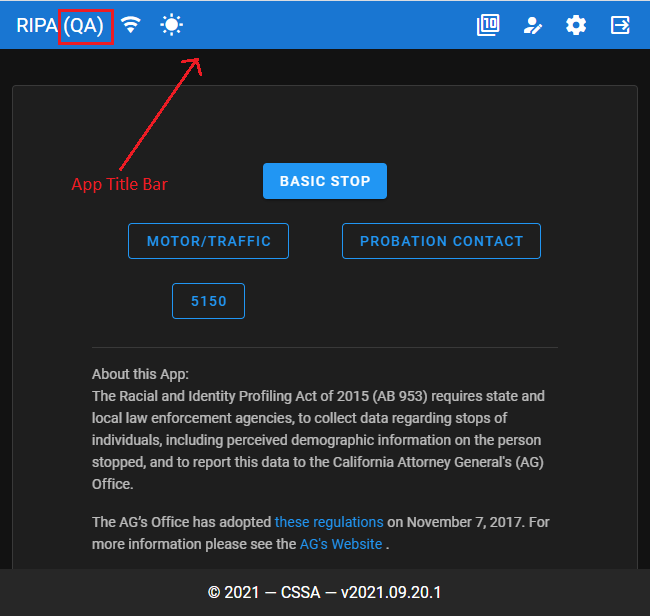
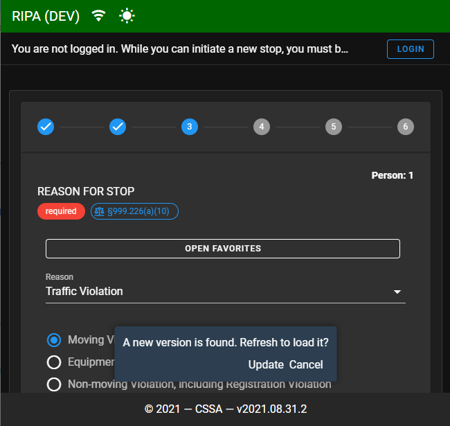
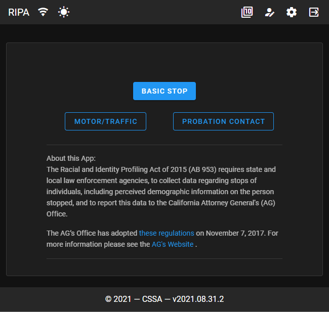

# Cal-RIPA Environment

## RIPA Environment Configuration

RIPA has UI elements to display and notify the end user as to what "Environment" the system is deployed and configured for. RIPA provides for 3 environment values, DEV, QA & PROD. When DEV or QA are the configured environment you will see the "Title" bar at the top of the screen displays the chosen environment and an alternate color like Green for DEV and Blue for QA. When configured for PROD the UI will NOT show "PROD" and the "Title" bar will be the default application colors.

## Configuring the application environment

Follow the [application configuration](./APP-CONFIG.md) instructions to edit the config.json file and configure the environment setting. When editing this file be sure to set the "Environment" property to the desired value of "DEV", "QA" or "PROD".

## QA Environment Example

|  |
|-

## DEV Environment Example

|  |
|-

## PROD Environment Example

|  |
|-
