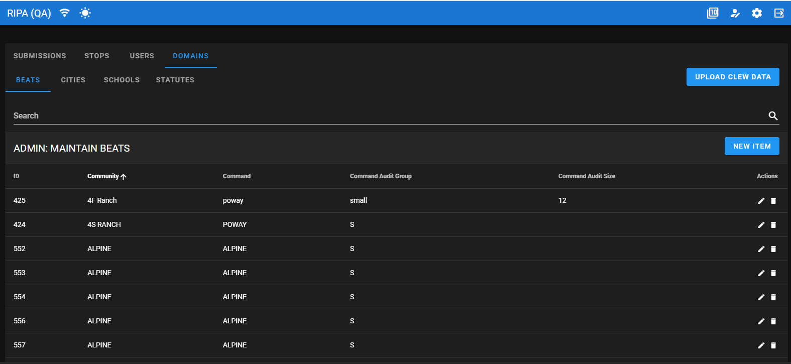

# Cal-RIPA

## STOP Beats

RIPA has UI elements to manage Beats (assignments) and an ability to capture the assigned Beat during the STOP entry event. This data is not required by the DoJ, but could be valuable to your agency to identify areas or locations of concentrated concern.

Follow the [application configuration](./APP-CONFIG.md) instruction to edit the config.json file and turn on the STOP Beats UI elements. When editing this file be sure to set the "DisplayBeatsInput" property to the desired value of "true" or "false".

|  |
|-

|  |
|-
