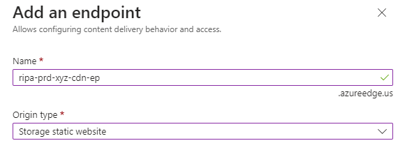
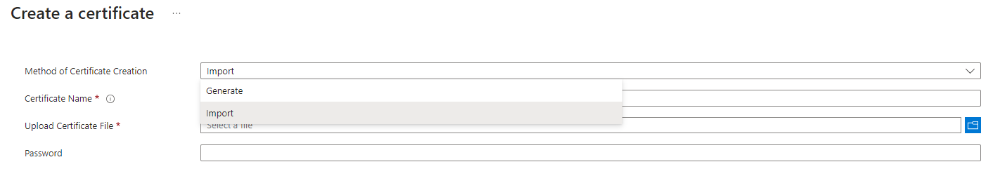

# Cal-RIPA Custom Domain

## CDN Profile Configuration

To configure a custom domain for RIPA, you need to create a front door and CDN profile. Follow these steps:

1. Navigate to the resource group where RIPA is installed.
2. Create a front door and CDN profile.
3. Open the front door and CDN profile, and create a new endpoint.
4. For the endpoint name, use the following syntax: `ripa-prd-xyz-cdn-ep`, with `xyz` being your agency abbreviation. Keep in mind, this example is assuming you're updating your production environment.
5. For origin type, choose **storage static website**, and for the hostname select the name of your storage account that ends in `ui`. For example, `xyzripaprduisa`
6. Origin host header should mirror origin hostname, everything else can be left unmodified.

7. Once everything looks correct, click add to create your endpoint.

## Custom Domain Configuration

After the endpoint has been created, open it and follow these steps to configure a custom domain:

Keep in mind, for this step to work, you must first set up a CNAME record with your DNS provider, which will point to your CDN endpoint.

1. Click "custom domain" to create a custom domain.
2. Endpoint hostname gets pre-filled from your CDN endpoint URL, you can't change this value
3. Custom hostname: Enter your custom domain, including the subdomain. For example, `ripa.xyz.net`
4. Select add, Azure will verify that the CNAME record exists for the hostname entered. If you set up your CNAME record correctly, it gets validated.

For more details, visit Microsoft's tutorial here: https://learn.microsoft.com/en-us/azure/cdn/cdn-map-content-to-custom-domain?tabs=azure-dns%2Cazure-portal%2Cazure-portal-cleanup

## Certificate Setup

You will need to import your certificate to the keyvault in your resource group.

1. Navigate to your key vault and click generate/import.
2. Select import, name your certificate, and then upload your certificate file.
3. Enter the password for the certificate.
4. Click create.

Once you've imported the certificate to the keyvault, go back to your custom domain that you created in your endpoint.

### Configuration Steps

Prerequisite: You will need to give the CDN permissions to access the certificate you imported in the Key Vault. Instructions are displayed above the Key Vault selection.

1. Leave custom domain HTTPS on.
2. For certificate management type, select "use my own certificate"
3. Minimum TLS version: TLS 1.2
4. Select the key vault where you imported your cert.
5. For certificate/secret, select the name of your cert that you imported. 
6. Certificate/Secret version: Latest 

After completing these steps, you should be able to access RIPA via your custom domain.

## Updating the Certificate

When your certificate expires, you will need to import a new certificate and repeat the configuration steps above.

1. Import the new certificate into the Key Vault that is linked to the CDN profile.
2. In the Azure Portal, navigate to the CDN profile and select the "Custom domains" tab.
3. Click on the custom domain that you want to update. 
4. Keep all of the configuration settings the same as before.
5. For certificate/secret, select the name of your newly imported cert. 
6. Save the changes
