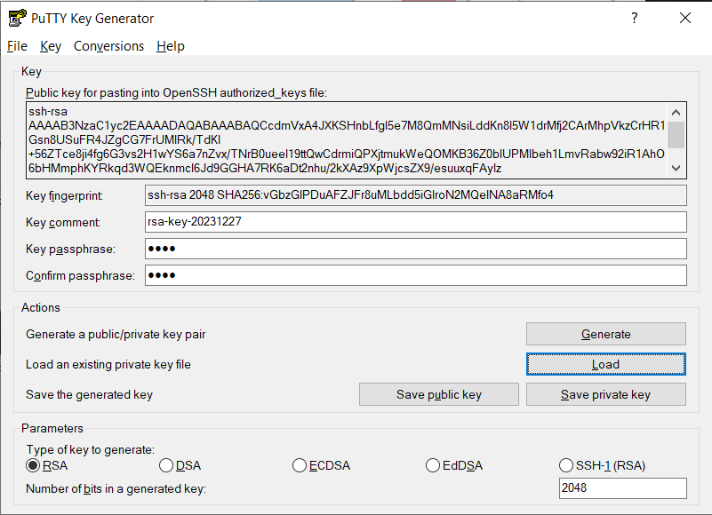
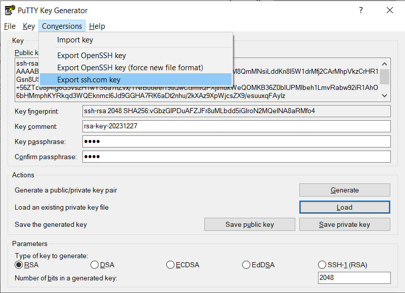
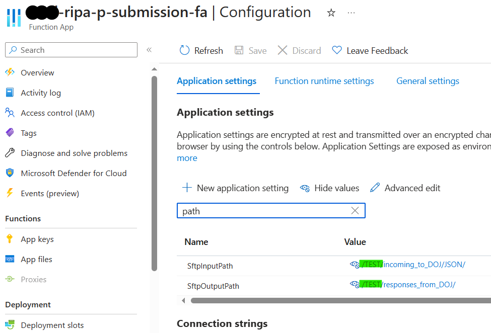

# Cal-RIPA DOJ SFTP Configuration

The CSSA RIPA application utilizes the SFTP option for connecting and transmitting stop data to CA DOJ. You will need to save your SFTP credentials in the RIPA KeyVault within the Resource Group of your deployment. Technically the key configuration is not required until you want to make your first submission to CA DOJ.

If you don't have credentials, you may request them by contacting [stopdatasupport@doj.ca.gov](mailto:stopdatasupport@doj.ca.gov)

## Test and Prepare your Key

Once you have obtained your SSH key from CA DOJ the first thing you need to do is test it in an SFTP client such as FileZilla to confirm that you can connect successfully. If you are trying this from your enterprise network note that you may have to configure proxy and/or firewall settings.

The RIPA system uses a very specific key format, so you must use the PuttyGen utility to export the key in the right format:

1. In the File menu go to load private key (keep parameters set to RSA, 2048)
   
1. Enter a passphrase, you will need this in subsequent steps
1. In the Conversions menu export ssh.com key and save it. The file extension does not matter.
   

Now your key is ready to be used either during installation steps or by manually uploading in the following steps.

## Set during installation

During Marketplace deployment there is a step to set the DOJ SFTP credentials and keys, but you can also skip this and do it manually after installation.

- **SFTP server host name** - This is the IP Address of CA DOJ SFTP Server
- **SFTP server key** - SSH Private Key (open keyfile you exported from Puttygen and copy the string content)
- **Username** - This is the CA DOJ assigned SFTP username for your agency
- **Password** - This is the passphrase you set for your Private Key in Puttygen
- **DoJ Test or Production configuration** - this setting will determine which folder on the DOJ SFTP you will connect to.

## Set Manually

If you chose to skip setting the key during app deployment you can set the secrets and keys manually.

Go to the KeyVault within the Resource Group of your deployment and set the following secrets. If you cannot access your secrets create an access policy with permissions to secrets for yourself (you may need to request this from a subscription owner at your agency).

1.  **SftpHost** - This is the IP Address of CA DOJ SFTP Server
1.  **SftpPassword** - This is the passphrase you set for your Private Key in Puttygen
1.  **SftpUsername** - This is the CA DOJ assigned SFTP username for your agency
1.  **SftpKey** - SSH Private Key, this has to be set via Azure CLI because of encoding. Make sure you have the following tools installed

    1.  PowerShell (at least version 5.1 or greater)
        https://docs.microsoft.com/en-us/powershell/scripting/install/installing-powershell-core-on-windows?view=powershell-7.1
    2.  Azure Cli (at least version 2.10 or greater)
        https://docs.microsoft.com/en-us/cli/azure/install-azure-cli
    3.  Set Cloud to Government
        -     az cloud set -n AzureUSGovernment
    4.  Login
        -     az login
    5.  Update private SSH key SftpKey using this CLI command. Make sure you replace the keyvault name with yours and also use the key file that you saved when exporting it in Puttygen. If you are not running the command in the directory of the file, use an absolute path in the command.
        -     az keyvault secret set --name SftpKey --vault-name MyKeyVaultName --file myprivatekey.ppk --encoding utf-8

## Switching Test and Production

When you select Test(non-production), the application will connect to the /TEST folder and upload stops to /TEST/incoming_to_DOJ/JSON. This is the default and should be used for all environments except Production.

When you select Production, the application will connect to the /PROD folder and upload stops to /PROD/incoming_to_DOJ/JSON.

To confirm or change these settings go to the Azure Gov Portal and navigate to the submission function app. There open the app settings configuration blade and look for these settings:

- SftpInputPath - Value should be `/TEST/incoming_to_DOJ/JSON/` or `/PROD/incoming_to_DOJ/JSON/`
- SftpOutputPath - Value should be `/TEST/responses_from_DOJ/` or `/PROD/responses_from_DOJ/`
- SftpDisabled - Should be set to `false`, otherwise SFTP submissions will be disabled

