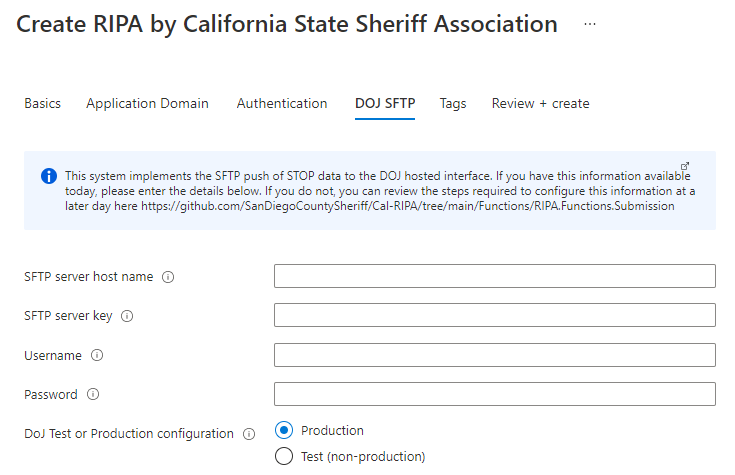

# Cal-RIPA DOJ SFTP Configuration

To send Stop data to CA DOJ, you will need to save your SFTP credentials in the application KeyVault within the Resource Group of your deployment.

If you don't have credentials, you may request them by contacting [stopdatasupport@doj.ca.gov](mailto:stopdatasupport@doj.ca.gov)

During Marketplace deployment you can set the credentials and keys, but you can also skip this and do it manually after installation.

## Update KeyVault Secrets Manually

If you skipped this step during app deployment you can set the secrets and keys manually. Go to the KeyVault within the Resource Group of your deployment and set the following secrets.

1. **SftpHost** - This is the IP Address of CA DOJ SFTP Server
1. **SftpPassword** - This is the passphrase for your Private Key
1. **SftpUsername** - This is the CA DOJ assigned username for your agency
1. **SftpKey** - SSH Private Key

   Update private SSH key SftpKey via cli:  
    `az keyvault secret set --name SftpKey --vault-name MyKeyVaultName --file myprivatekey.ppk --encoding utf-8`

## Submission Function App Settings

When you select Test(non-production), the application will connect to the /TEST folder and upload stops to /TEST/incoming_to_DOJ/JSON. This is the default and should be used for all environments except Production.

When you select Production, the application will connect to the /PROD folder and upload stops to /PROD/incoming_to_DOJ/JSON.

To confirm these settings go to the Azure Gov Portal and navigate to the submission function app configuration blade.

- SftpInputPath - Value should be `/TEST/incoming_to_DOJ/JSON/` or `/PROD/incoming_to_DOJ/JSON/`
- SftpOutputPath - Value should be `/TEST/responses_from_DOJ/` or `/PROD/responses_from_DOJ/`
- SftpDisabled - Should be set to `false`, otherwise SFTP submissions will be disabled
