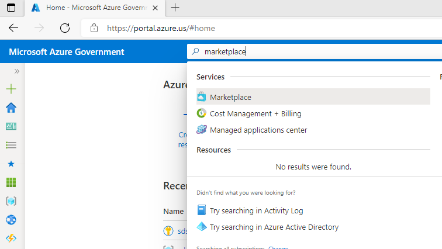
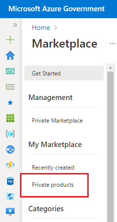
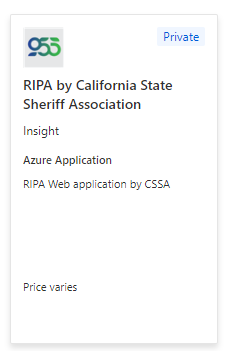
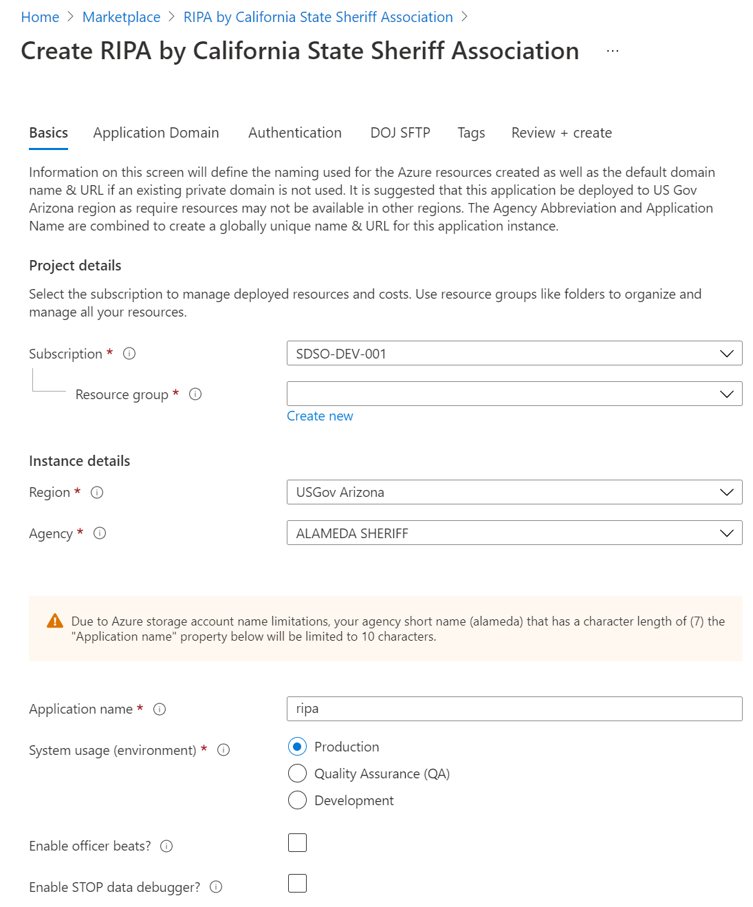
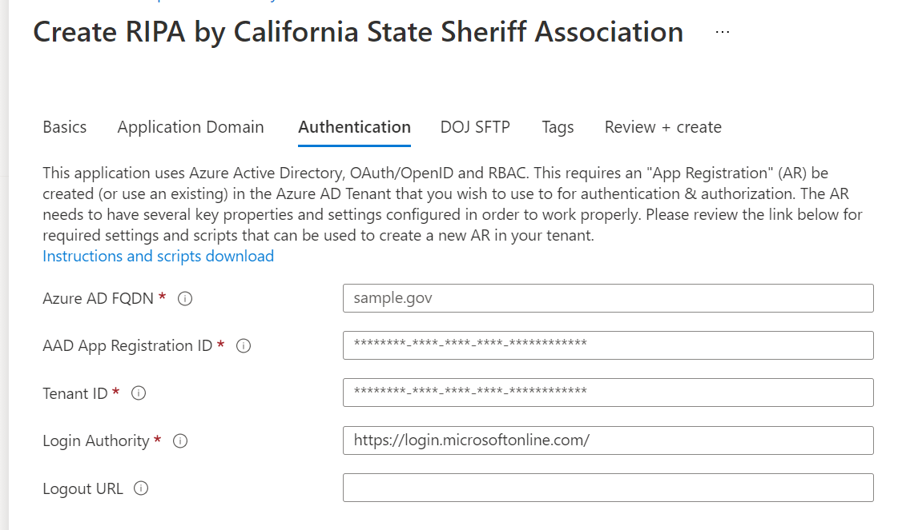

# Cal-RIPA

## Installation CSSA RIPA Web Application from the Azure Marketplace Private Offerings

First, you must work with the CSSA team to get an Azure subscription setup for you. Then you can follow these instructions to install an instance of the application.

1. Use the in [Create Authentication Scheme](./AUTHENTICATION.md) instructions to create your authentication & authorization resource.
2. Navigate to the Azure US Government portal [https://portal.azure.us]https://portal.azure.us
3. Using the main search bar, search for and select "Marketplace"

|  |
|-

4. Now you can select the "Private products" blade on the left-hand side menu.

|  |
!-

5. Select the "RIPA by California State Sheriff Association" Marketplace offering and click the create button.

|  |
|-

6. In the next step make sure you select the following details as the relate to the installation you are currently executing.

|  |
|-

   1. Be sure to select the correct Subscription.
   2. Create a new or select an existing Resource Group.
   3. It is suggested to leave the "Region" as "USGov Arizona" as this is the closest region to California.
   4. Pick your agency from the dropdown list.
   5. Choose an appropriate name for this installation. like "ripa-test" for a test system installation or "ripa" for a production system.

      1. You will be limited to the length desplayed in the message because the system is designed to standardize Azure resource names and Azure has certain limits we must abide by.

   6. Select the envirnment type for this installation. The choices are DEV, QA & PROD. DEV & QA change the UI to have color coded headers to make it easy to identify NON-PROD installations.
   7. Select the "Enable officer beats" checkbox if you want to use the "Beats" UI compnents (i.e. the STOP will require the user to select a Beat). This can be turned on or off later on based on these instructions [Configuring Beats](./BEATS.md).
   8. Select the "Enable STOP data debugger" if you want to access the STOP data debugger (a screen element that lets you view the current STOP data). This can be turned on or off later on based on these instructions [Configuring STOP Data Debugger](./STOP-DEBUGGER.md).

7. In this step (Application Domain) you can choose to use the DNS & SSL Certificate provided by CSSA or you can bring you own certificate and DNS records. The easiest and recomended approach is to use the CSSA option.

   1. It is strongly recomended that you highlight and copy the DNS host name {appName-agency}.cssa.cloud for example. You will most likely need to reference it later and you will provide it to the end users so they can access the application.

8. On the (Authentication) tab you will enter the information generated from the script you ran in "Step 1 (Create Authentication Scheme)" above.

   1. Be sure to provide at least the first 3 fields, FQDN, AppId & TenantId.
   2. Logout URL is not required but helpful if youwish your end users to log out of everywhere from the applcation. This is unusual.

|  |
|-

9. The "DOJ SFTP" tab is **NOT** required to install the application, however, you will need to configure this later if you do not have the details onhand. You can find instructions [DoJ sFTP Configuration](./DOJ-CONFIGURATION.md)

|  |
|-

10. The last important tab is the "Tags". The application will automatically generate a few tags and apply them to your installation. Youo can use this section to add your specific tags (name/value pairs).

    1. application = ripa.
    2. agency = your appreviated agency name chosen in "Step 6".
    3. agency_ori = your California DoJ assigned ORI.
    4. template_version = the version of the Marketplace Offering used for this installation.

11. Finally we are ready to install the application! Click the "Review and create" button to install you new instance of RIPA by CSSA.
