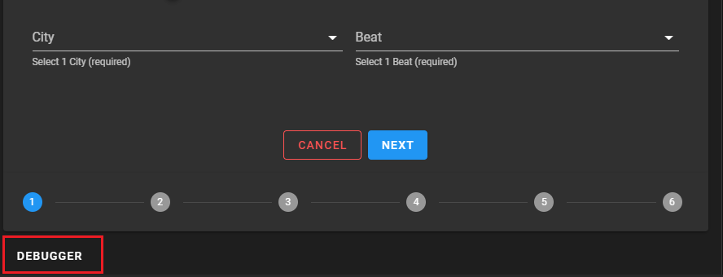
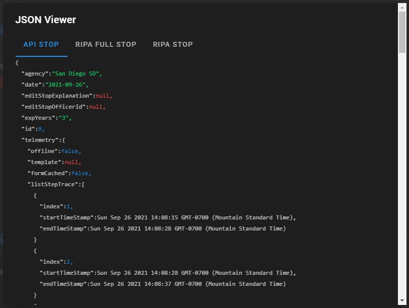
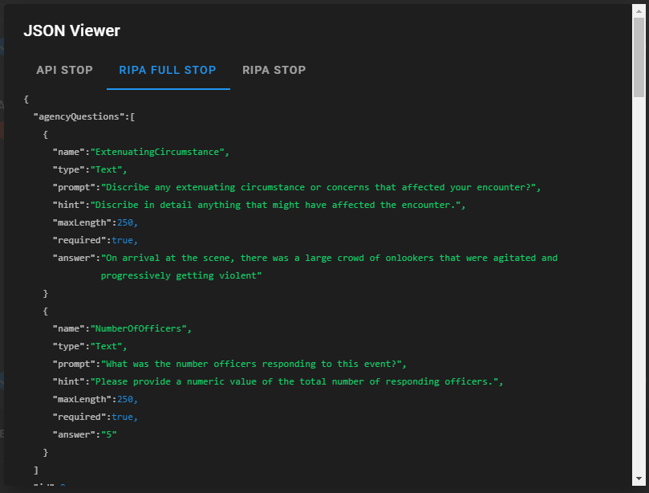

# Cal-RIPA

## STOP Data Debugger

RIPA has a hidden gem that lets you see the Json data objects as you progress thru a STOP entry event. You can configure RIPA to display a hidden button at the bottom of the STOP entry form by following the instructions below. Once the debugger has been configured you can find the link/button.

    |  |
    |-

Follow the [application configuration](./APP-CONFIG.md) instruction to edit the config.json file and turn on the STOP Data Debugger. When editing this file be sure to set the "DisplayDebugger" property to the desired value of "true" or "false".

## What do I see?

The STOP Data Debugger has 2 sections (tabs). The "RIPA STOP" tab shows the json data that is used internally to the UI. This json structure never leaves the UI as it is translated to the "API STOP" json object before being sent to the backend STOP API. The "API STOP" is as it sounds the contract between the user interface and the STOP Azure Function APIs.

### RIPA STOP

|  |
|-

### API STOP

|  |
|-
